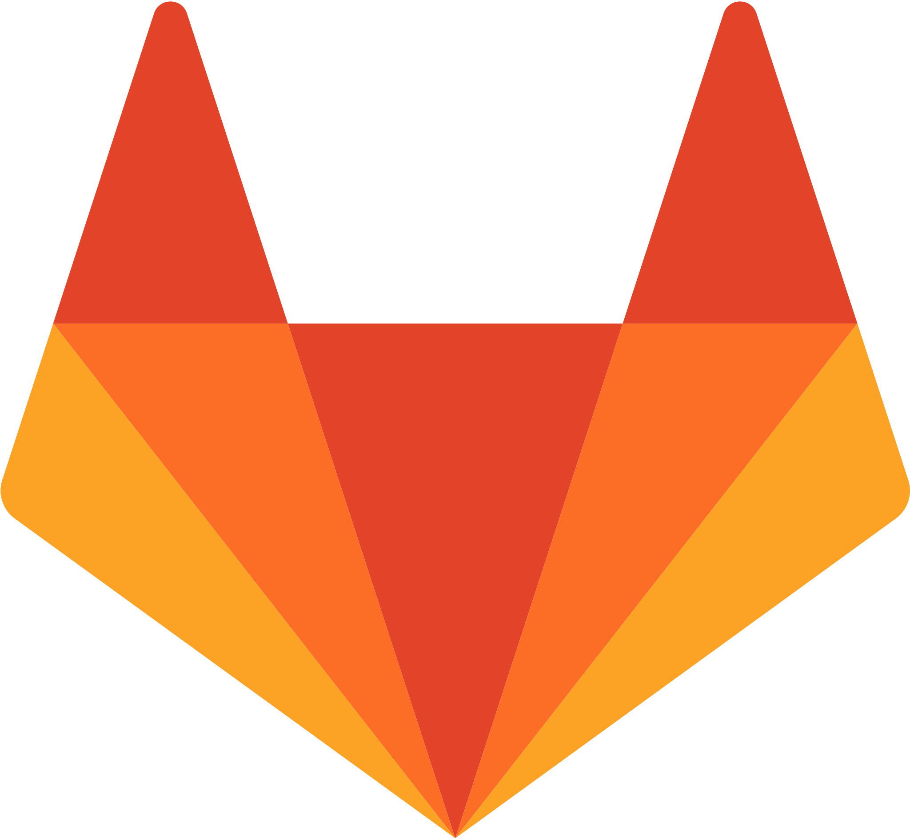

[](https://deepwiki.com/paramify/evidence-fetchers)
[](fetchers/Paramify%20Fetchers%20Catalog.md)
[](https://github.com/paramify/evidence-fetchers/actions/workflows/github-code-scanning/codeql)
[](https://github.com/paramify/evidence-fetchers/actions/workflows/dependency-graph/auto-submission)

# Evidence Fetchers

Let's go fetch some evidence! And don't forget, screenshots are so 2012.

## Quick Start

Run the main script to access all functionality:

```bash
python main.py
```

## Main Options

**0) Prerequisites** - Set up environment variables and check dependencies  

**1) Select Fetchers** - Choose which evidence fetcher scripts to use and generate evidence_sets.json  

**2) Create Evidence Sets in Paramify** - Upload evidence sets to Paramify via API  

**3) Run Fetchers** - Execute evidence fetcher scripts and store evidence files  

**4) Upload Evidence to Paramify** - Find latest evidence directory and upload to Paramify  

## Key Features

- **Evidence Sets**: Selectively choose which fetchers to run based on your needs
- **Paramify Integration**: Automatic upload of evidence sets and evidence files
- **Timestamped Storage**: All evidence stored in organized, timestamped directories
- **Multi-Instance Support**: Run the same fetcher against multiple AWS regions or GitLab projects

## Supported Services

<div align="center">

<a href="fetchers/aws/"></a>
<a href="fetchers/sentinelone/"></a>
<a href="fetchers/k8s/"></a>
<a href="fetchers/knowbe4/"></a>
<a href="fetchers/okta/"></a>
<a href="fetchers/gitlab/"></a>
<a href="fetchers/rippling/"></a>
<a href="fetchers/checkov/"></a>


</div>

## Coming Soon

More evidence fetchers and integrations are coming soon. To request a new fetcher or upvote which services should be supported next, head to the [Paramify Community Feature Requests](https://support.paramify.com/hc/en-us/community/topics/31851789568275-Feature-Requests). Add a new request or comment and upvote existing ones to help prioritize what we build next.

<div align="center">


Planned Fetchers/Integrations

</div>

## Directory Structure

```
evidence-fetchers/
├── main.py                   # Main menu system
├── fetchers/                 # Evidence fetcher scripts
│   ├── aws/                  # AWS scripts (29 available)
│   ├── sentinelone/          # SentinelOne scripts (5 available)
│   ├── k8s/                  # Kubernetes scripts (3 available)
│   ├── knowbe4/              # KnowBe4 scripts (4 available)
│   ├── okta/                 # Okta scripts (7 available)
│   ├── gitlab/               # GitLab scripts (3 available)
│   ├── rippling/             # Rippling scripts (2 available)
│   └── checkov/              # Checkov scripts (2 available)
├── 0-prerequisites/          # Setup and dependencies
├── 1-select-fetchers/        # Fetcher selection
├── 2-create-evidence-sets/   # Create evidence sets in Paramify
├── 3-run-fetchers/           # Execute fetchers
├── 4-upload-to-paramify/     # Upload evidence to Paramify
├── 5-tests/                  # Testing and validation
├── 6-add-new-fetcher/        # Add new fetchers
└── extra-supporting-scripts/ # Additional tools
```

## Environment Variables

Create a `.env` file with:

```bash
# Required: Paramify API Configuration
PARAMIFY_UPLOAD_API_TOKEN=your_api_token_here
PARAMIFY_API_BASE_URL=https://app.paramify.com/api/v0

# Optional: Service-specific configuration
AWS_PROFILE=your_aws_profile
AWS_REGION=us-east-1
KNOWBE4_API_KEY=your_knowbe4_api_key
OKTA_API_TOKEN=your_okta_api_token
OKTA_ORG_URL=https://your-org.okta.com

```

## Dependencies

- Python 3.x
- dotenv (load env variables in python)
- AWS CLI (for AWS scripts)
- jq (JSON processor)
- curl (HTTP client)
- kubectl (for Kubernetes scripts)

## Documentation

- **Component docs**: See `README.md` in each numbered directory
- **DeepWiki docs**: [Evidence Fetchers on DeepWiki](https://deepwiki.com/paramify/evidence-fetchers)
- **Fetcher catalog & KSIs**: [`Paramify Fetchers Catalog`](fetchers/Paramify%20Fetchers%20Catalog.md)
